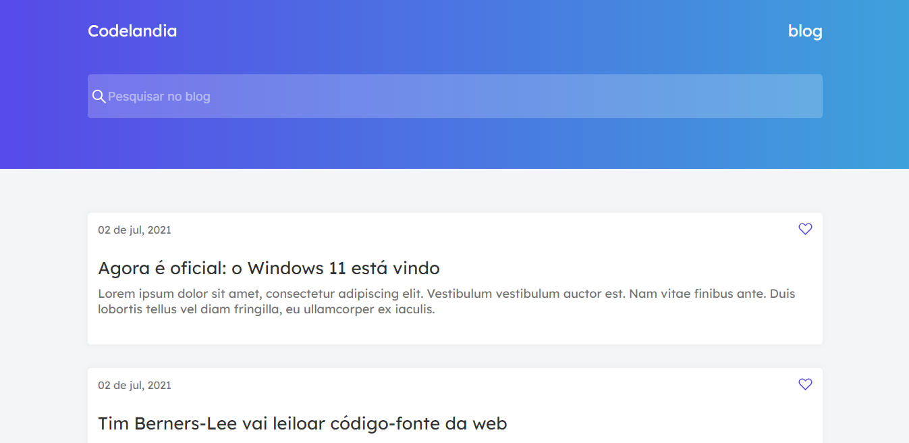

# Newsletter Tech



> Linha adicional de texto informativo sobre o que o projeto faz. Sua introdução deve ter cerca de 2 ou 3 linhas. Não exagere, as pessoas não vão ler.
### Ajustes e melhorias

O projeto ainda está em desenvolvimento e as próximas atualizações serão voltadas nas seguintes tarefas:

- [x] Cabeçalho
- [x] Lista de cards
- [x] Card
- [x] Responsividade
- [ ] Integração

## 💻 Pré-requisitos

Antes de começar, verifique se você atendeu aos seguintes requisitos:
<!---Estes são apenas requisitos de exemplo. Adicionar, duplicar ou remover conforme necessário--->
* Você instalou a versão mais recente do `Node`
* Você tem uma máquina `Windows / Linux / Mac`

## 🚀 Instalando Newsletter Tech

Para instalar o Newsletter Tech, siga estas etapas:

Linux e macOS:
#### *Faça o clone do projeto*
```
git clone https://github.com/santosfernando2377/Newsletter-Tech.git
```
#### *Execute o seguinte comando no prompt de comando*
```
npm install
```
Windows:
#### *Faça o clone do projeto*
```
git clone https://github.com/santosfernando2377/Newsletter-Tech.git
```
#### *Execute o seguinte comando no prompt de comando*
```
npm install
```

## ☕ Usando Newsletter Tech

Para usar Newsletter Tech, siga estas etapas:

```
Execute o comando 'npm run dev'
```

Adicione comandos de execução e exemplos que você acha que os usuários acharão úteis. Fornece uma referência de opções para pontos de bônus!

## 📫 Contribuindo para Newsletter Tech
<!---Se o seu README for longo ou se você tiver algum processo ou etapas específicas que deseja que os contribuidores sigam, considere a criação de um arquivo CONTRIBUTING.md separado--->
Para contribuir com Newsletter Tech, siga estas etapas:

1. Bifurque este repositório.
2. Crie um branch: `git checkout -b <nome_branch>`.
3. Faça suas alterações e confirme-as: `git commit -m '<mensagem_commit>'`
4. Envie para o branch original: `git push origin <nome_do_projeto> / <local>`
5. Crie a solicitação de pull.

Como alternativa, consulte a documentação do GitHub em [como criar uma solicitação pull](https://help.github.com/en/github/collaborating-with-issues-and-pull-requests/creating-a-pull-request).

## 🤝 Colaboradores

Agradecemos às seguintes pessoas que contribuíram para este projeto:

<table>
  <tr>
    <td align="center">
      <a href="#">
        <br>
        <sub>
          <b>Fernando Soares</b>
        </sub>
      </a>
    </td>
  </tr>
</table>


## 😄 Seja um dos contribuidores<br>

Quer fazer parte desse projeto? Clique [AQUI](CONTRIBUTING.md) e leia como contribuir.

## 📝 Licença

Esse projeto está sob licença. Veja o arquivo [LICENÇA](LICENSE.md) para mais detalhes.

[⬆ Voltar ao topo](#nome-do-projeto)<br>